# **Báo cáo cá nhân**

---

**Lê An Bình _ 23133007**

**Lớp Trí tuệ nhân tạo_ Nhóm 05 (nhúng chuyển lớp...)**

---

## 1.	Mục tiêu

Mục tiêu của project là triển khai, trực quan hóa và so sánh hiệu suất của các thuật toán giải bài toán 8-puzzle (trò chơi 8 ô chữ), bao gồm các nhóm thuật toán tìm kiếm có thông tin, không có thông tin và các phương pháp học tăng cường (Reinforcement Learning).

## 2.	Nội dung

### 2.1	Các thuật toán CSP

CSP (Constraint Satisfaction Problem) – hay Bài toán thỏa mãn ràng buộc – là một loại bài toán trong trí tuệ nhân tạo, nơi nhiệm vụ là tìm giá trị cho tập biến sao cho thỏa mãn tất cả các ràng buộc (constraints) đã cho.

#### 2.1.1 Backtracking (bsa.py)

Backtracking là thuật toán tìm kiếm theo chiều sâu kết hợp với việc quay lui khi phát hiện không thể tiếp tục tìm kiếm giải pháp hợp lệ trong bài toán. Nó thường được dùng để giải các bài toán quyết định, bài toán tổ hợp hoặc các bài toán ràng buộc.

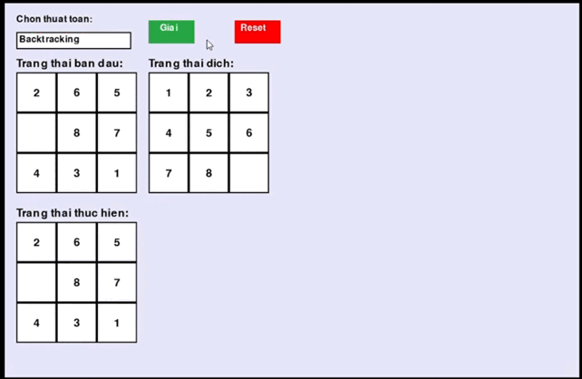

#### 2.1.2 Backtracking with forwardchecking (backtracking_with_forward_checking.py)

Backtracking with Forward Checking là một kỹ thuật tìm kiếm kết hợp giữa phương pháp backtracking (quay lui) và forward checking (kiểm tra tiến về phía trước), nhằm giảm thiểu việc thử nghiệm các nhánh không khả thi trong không gian tìm kiếm bằng cách loại bỏ giá trị không hợp lệ ngay khi chọn biến.

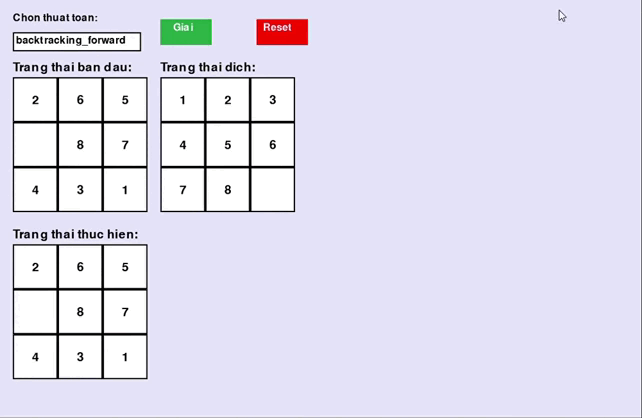

### 2.2	Các thuật toán Complex Environment

Trong trí tuệ nhân tạo, môi trường phức tạp (complex environment) thường mô tả những bài toán mà: Trạng thái không đầy đủ (partial observability), Không chắc chắn (uncertainty), Tác động của hành động không rõ ràng (non-determinism), Không gian trạng thái rất lớn hoặc động (dynamic state space). Những đặc trưng này đòi hỏi các thuật toán phải xử lý nhiều khả năng, biểu diễn trạng thái niềm tin, hoặc duy trì kế hoạch cho nhiều nhánh kết quả.

#### 2.2.1 And Or Search (and_or_search.py)

And-Or Search là thuật toán tìm kiếm mở rộng cho các bài toán có thể xảy ra các trường hợp phân nhánh phức tạp, bao gồm các tình huống có điều kiện phụ thuộc hoặc các bài toán mang tính quyết định và ngẫu nhiên, như trong lập kế hoạch dưới sự không chắc chắn hoặc trong các trò chơi.

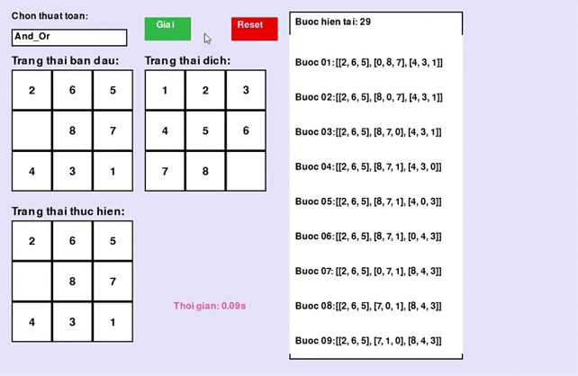

#### 2.2.2 Belief State Search (Belief_State_Search.py)

Belief State Search là phương pháp tìm kiếm trong không gian trạng thái mà agent không biết chính xác trạng thái hiện tại mà chỉ biết một tập hợp các trạng thái khả dĩ (gọi là belief state). Tức là, thay vì làm việc trên trạng thái thực tế, agent duy trì và cập nhật một phân phối xác suất (hoặc tập hợp các trạng thái có thể) đại diện cho sự không chắc chắn về trạng thái.

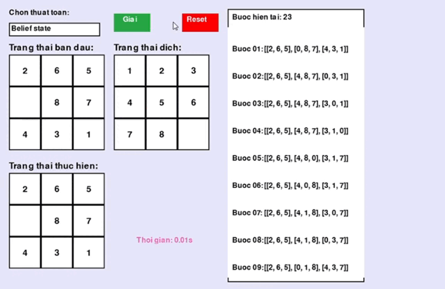

#### 2.2.3 Searching With Partically Observation (sbo.py)

Là loại tìm kiếm trong môi trường mà agent không thể quan sát đầy đủ toàn bộ trạng thái hiện tại của môi trường. Thay vì biết chính xác trạng thái hiện tại, agent chỉ nhận được thông tin quan sát một phần hoặc không chắc chắn về trạng thái. Do đó, agent phải dựa vào các quan sát trước đó, các hành động đã thực hiện, và mô hình môi trường để suy đoán trạng thái hiện tại (gọi là belief state hay trạng thái tin tưởng).

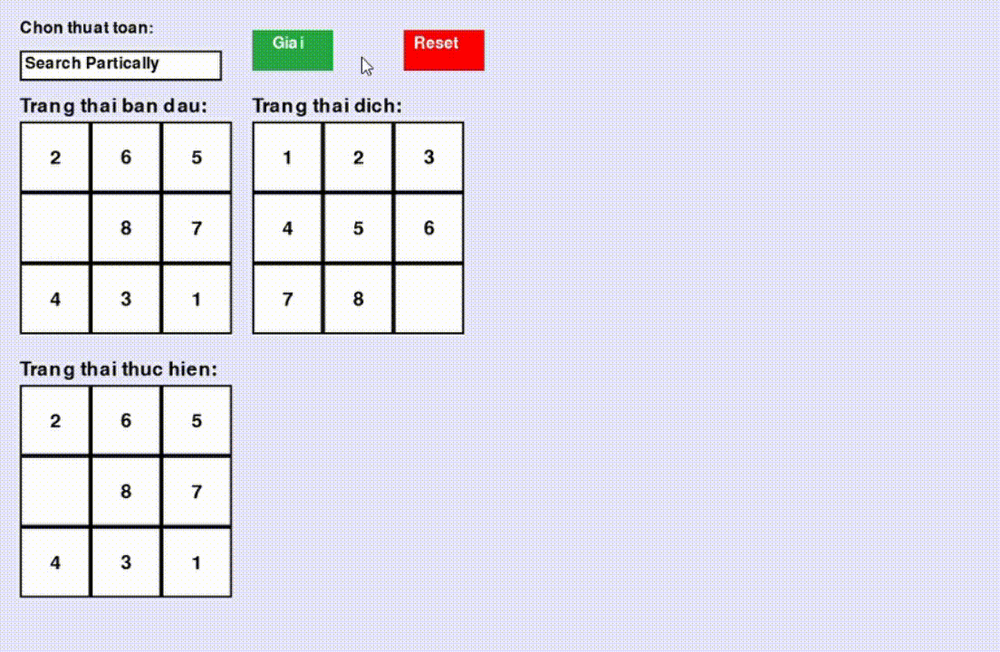

### 2.3	Các thuật toán Local Search

Local Search (Tìm kiếm cục bộ) là một nhóm thuật toán tối ưu hóa không duyệt toàn bộ không gian trạng thái, mà chỉ tập trung tìm lời giải bằng cách cải thiện dần từ một trạng thái hiện tại, dựa trên các trạng thái “láng giềng”.

#### 2.3.1 Genetic Algorithm (GA)

Genetic Algorithm (GA) là thuật toán tối ưu hóa và tìm kiếm dựa trên cơ chế tiến hóa sinh học, mô phỏng quá trình chọn lọc tự nhiên và di truyền để tìm nghiệm tối ưu hoặc gần tối ưu cho các bài toán phức tạp.

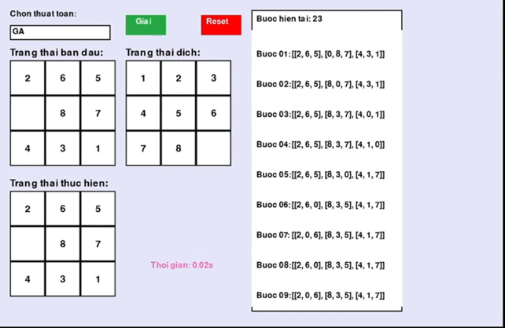

#### 2.3.2 Simple Hill Climbing (SHC_simple.py)

Simple Hill Climbing là thuật toán tìm kiếm và tối ưu đơn giản, trong đó tại mỗi bước chỉ chọn một trạng thái láng giềng đầu tiên mà có giá trị tốt hơn trạng thái hiện tại để di chuyển tới.

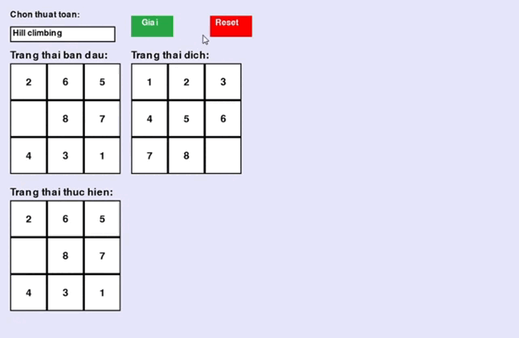

#### 2.3.3 Steepest Ascent Hill Climbing (Steepest_Ascent_hill_climbing.py)

Steepest Ascent Hill Climbing là một biến thể của thuật toán Hill Climbing trong đó, tại mỗi bước, thuật toán xem xét tất cả các trạng thái láng giềng và chọn trạng thái có giá trị cải thiện tốt nhất (tăng hoặc giảm lớn nhất tùy bài toán) để chuyển sang.

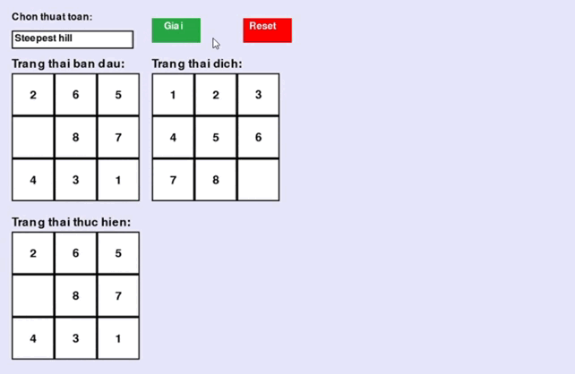

#### 2.3.4 Stochastic Hill Climbing (stochastic_hill_climbing.py)

Stochastic Hill Climbing là một biến thể của thuật toán Hill Climbing, trong đó thay vì luôn chọn bước đi tốt nhất kế tiếp, thuật toán sẽ chọn ngẫu nhiên một trong số các bước đi cải thiện hiện tại, giúp tránh bị mắc kẹt sớm trong cực tiểu cục bộ.

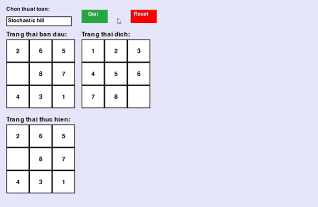

#### 2.3.5 Beam Search (beam.py)

Beam Search là thuật toán tìm kiếm heuristic dùng để rút gọn không gian tìm kiếm bằng cách chỉ giữ lại một số lượng giới hạn các nút tốt nhất ở mỗi bước thay vì giữ toàn bộ các nút mở rộng, giúp giảm chi phí tính toán và bộ nhớ so với thuật toán tìm kiếm đầy đủ như BFS hay A*.

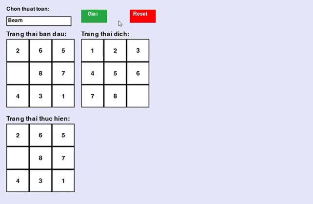

#### 2.3.6 Simulated Annealing (simulated_annealing.py)

Simulated Annealing là thuật toán tối ưu ngẫu nhiên dựa trên quá trình làm nguội kim loại (annealing) trong vật lý, nhằm tìm nghiệm gần tối ưu của bài toán tối ưu hóa phức tạp.

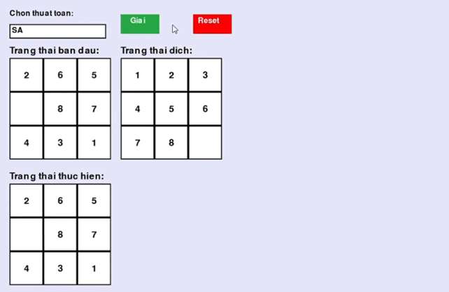

### 2.4	Các thuật toán Informed Search

Informed Search (Tìm kiếm có thông tin) là các thuật toán tìm kiếm được hỗ trợ bởi hàm heuristic – một hàm đánh giá giúp dự đoán “mức độ gần” của một trạng thái đến trạng thái đích. Mục tiêu là hướng dẫn tìm kiếm đi theo con đường hứa hẹn, từ đó tiết kiệm thời gian và bộ nhớ hơn so với các thuật toán không có thông tin như BFS hay DFS.

#### 2.4.1 IDA* (IDA_sao.py)

IDA* là thuật toán tìm kiếm kết hợp giữa Iterative Deepening Depth-First Search (IDDFS) và heuristic của A*, được thiết kế để giảm bộ nhớ sử dụng so với A*, trong khi vẫn đảm bảo tìm được đường đi tối ưu.

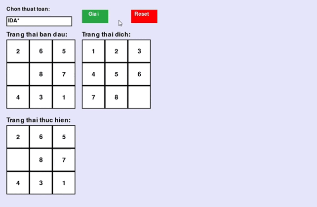

#### 2.4.2 A* (A_sao.py)

A* là thuật toán tìm kiếm đường đi hiệu quả và tối ưu, kết hợp giữa tìm kiếm theo chi phí tích lũy từ điểm xuất phát và ước lượng chi phí còn lại đến đích bằng một hàm heuristic.

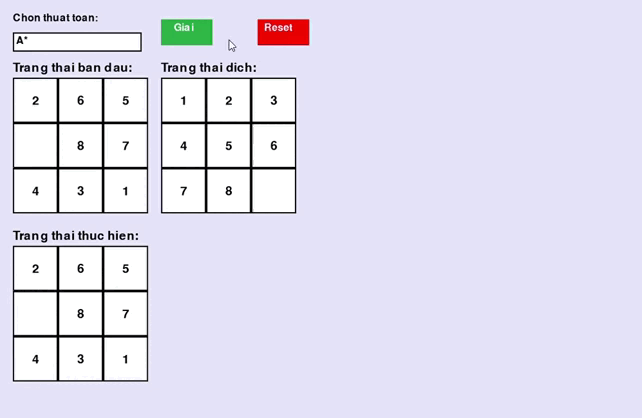

#### 2.4.3 Greedy Search (greedy_search.py)

Greedy Search (tìm kiếm tham lam) là thuật toán tìm kiếm trong không gian trạng thái, tại mỗi bước nó chọn mở rộng nút mà theo đánh giá hiện tại có vẻ “tốt nhất” hoặc gần với mục tiêu nhất dựa trên hàm đánh giá heuristic.

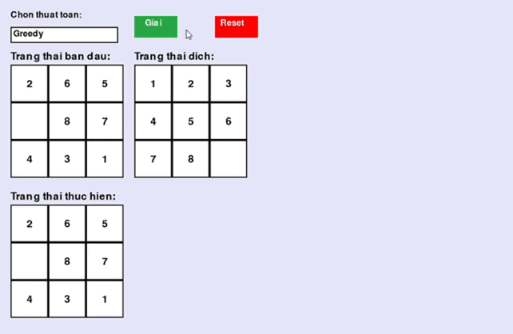

### 2.5	Các thuật toán Uniformed Search

Uninformed Search (Tìm kiếm không có thông tin) là các thuật toán không có bất kỳ kiến thức nào về đích ngoài chính đích. Chúng không sử dụng heuristic, và quyết định mở rộng trạng thái tiếp theo chỉ dựa trên cấu trúc của cây tìm kiếm.

#### 2.5.1 Breadth-First Search (BFS.py)

Breadth-First Search (BFS) là thuật toán duyệt hoặc tìm kiếm trong đồ thị hoặc cây theo từng lớp (mức) một, nghĩa là thăm tất cả các nút kề trực tiếp của nút hiện tại trước, rồi mới đi sâu sang các nút ở cấp độ kế tiếp.

#### 2.5.2 Depth-First Search (DFS.py)

Depth-First Search (DFS) là thuật toán duyệt hoặc tìm kiếm trong đồ thị hoặc cây bằng cách bắt đầu từ một nút gốc, sau đó đi sâu vào các nhánh con càng xa càng tốt trước khi quay lui để tìm các nhánh khác.

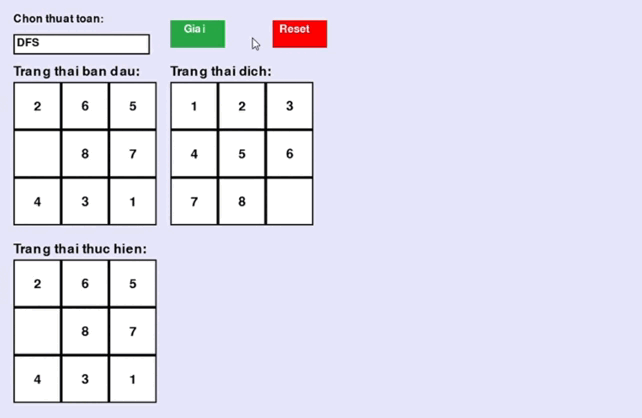

#### 2.5.3 Uniform Cost Search (UCS.py)

Uniform Cost Search là một thuật toán tìm kiếm đường đi ngắn nhất trong đồ thị có trọng số (các cạnh có chi phí khác nhau), dựa trên nguyên tắc luôn mở rộng nút có chi phí tích lũy nhỏ nhất từ điểm xuất phát đến nút đó.

#### 2.5.4 Iterative Deepening Search (IDS.py)

IDS là thuật toán kết hợp ưu điểm của Depth-First Search (DFS) và Breadth-First Search (BFS).
Nó thực hiện DFS nhưng giới hạn độ sâu, sau đó lặp lại với độ sâu tăng dần, cho đến khi tìm được lời giải.

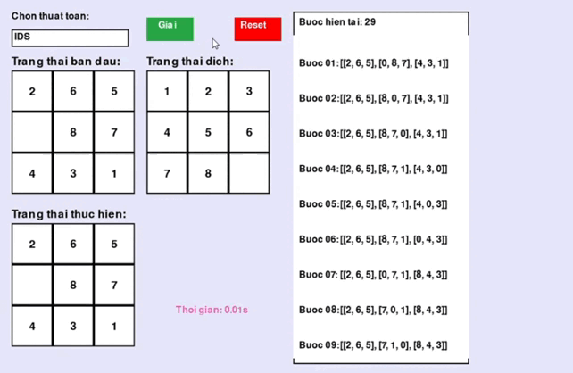

### 2.6	Các thuật toán Reinforcement Learning

Reinforcement Learning (RL) là một nhánh của học máy (Machine Learning), trong đó một tác nhân (agent) học cách hành động trong môi trường thông qua tương tác và phản hồi (phần thưởng).

#### 2.6.1 Q_learning (q_learning.py)

Q-Learning là một thuật toán học tăng cường (Reinforcement Learning) theo hướng off-policy, nghĩa là nó học từ hành động tối ưu (theo lý thuyết), không cần đúng hành động mà tác nhân thực sự thực hiện trong quá trình tương tác.

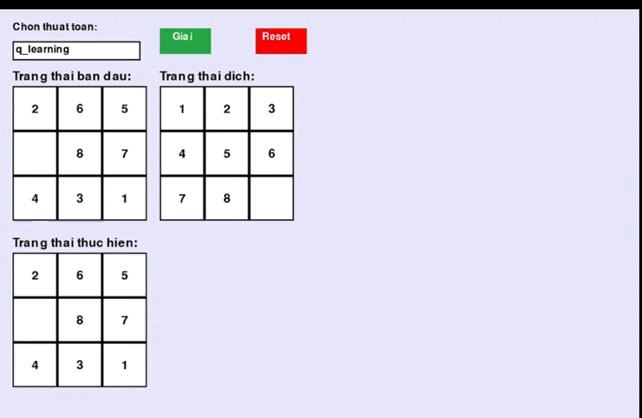

#### 2.6.2 SARSA (sarsa.py)
SARSA là một thuật toán học tăng cường (Reinforcement Learning) theo hướng on-policy, nghĩa là tác nhân học chính từ hành động mà nó thực sự thực hiện (theo chính sách hiện tại), chứ không phải hành động tốt nhất có thể.

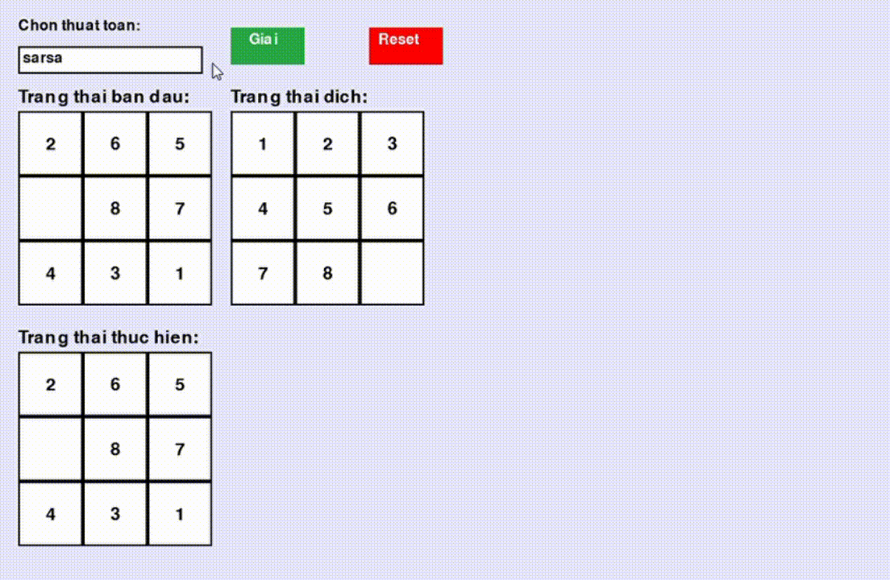

