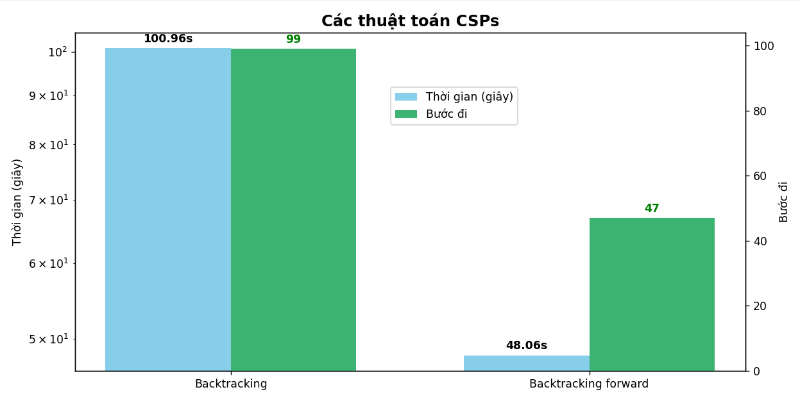
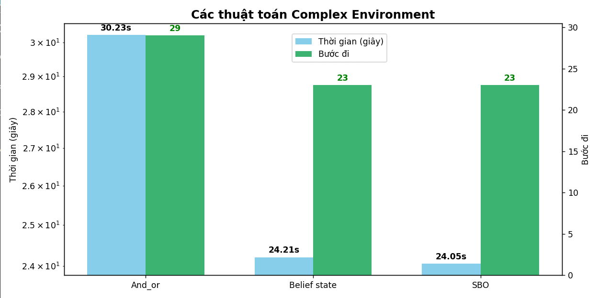
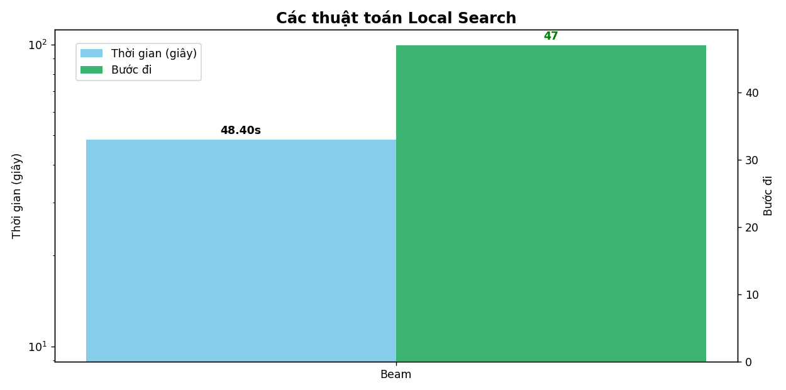
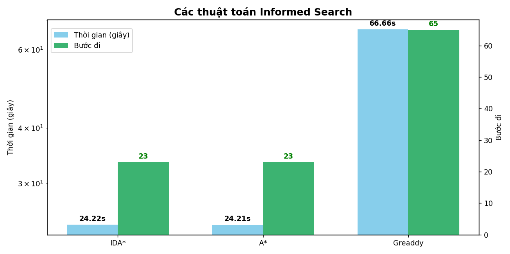
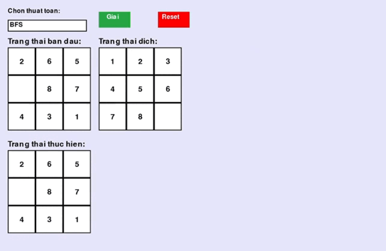
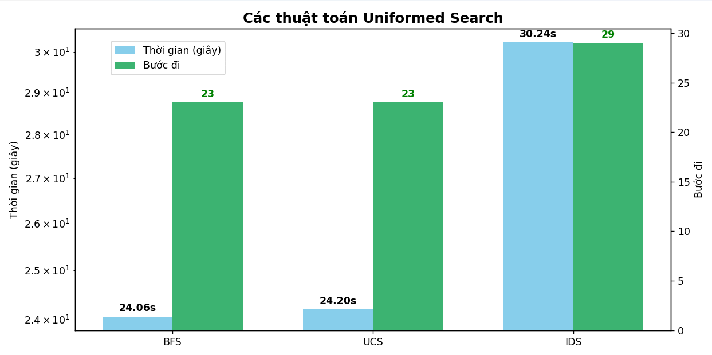
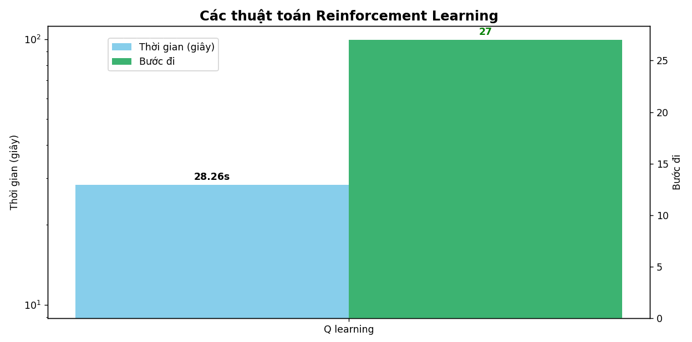

# **Báo cáo cá nhân**

---

**Lê An Bình _ 23133007**

**Lớp Tri tue nhan tao_ Nhom 05 (nhưng chuyển lớp và nộp bài trên Lớp Tri tue nhan tao_ Nhom 04))**

---

## 1.	Mục tiêu

Mục tiêu của project là triển khai, trực quan hóa và so sánh hiệu suất của các thuật toán giải bài toán 8-puzzle (trò chơi 8 ô chữ), bao gồm các nhóm thuật toán tìm kiếm có thông tin, không có thông tin và các phương pháp học tăng cường (Reinforcement Learning).

## 2.	Nội dung

### 2.1	Các thuật toán CSP

CSP (Constraint Satisfaction Problem) – hay Bài toán thỏa mãn ràng buộc – là một loại bài toán trong trí tuệ nhân tạo, nơi nhiệm vụ là tìm giá trị cho tập biến sao cho thỏa mãn tất cả các ràng buộc (constraints) đã cho.

#### 2.1.1 Backtracking (bsa.py)

Backtracking là thuật toán tìm kiếm theo chiều sâu kết hợp với việc quay lui khi phát hiện không thể tiếp tục tìm kiếm giải pháp hợp lệ trong bài toán. Nó thường được dùng để giải các bài toán quyết định, bài toán tổ hợp hoặc các bài toán ràng buộc.

#### 2.1.2 Backtracking with forwardchecking (backtracking_with_forward_checking.py)

Backtracking with Forward Checking là một kỹ thuật tìm kiếm kết hợp giữa phương pháp backtracking (quay lui) và forward checking (kiểm tra tiến về phía trước), nhằm giảm thiểu việc thử nghiệm các nhánh không khả thi trong không gian tìm kiếm bằng cách loại bỏ giá trị không hợp lệ ngay khi chọn biến.

#### So sánh hiệu suất và nhận xét Các thuật toán CSPs

Dựa trên biểu đồ so sánh giữa hai thuật toán giải bài toán ràng buộc (CSPs) là Backtracking và Backtracking Forward, có thể rút ra nhiều nhận định quan trọng về hiệu quả thực thi và khả năng tối ưu hóa của từng thuật toán trong việc giải quyết các bài toán có ràng buộc.

Trước hết, xét về thời gian thực thi, thuật toán Backtracking mất khoảng 100.96 giây, trong khi Backtracking Forward chỉ mất 48.06 giây để hoàn thành cùng một tác vụ. Điều này cho thấy rằng Backtracking Forward giúp rút ngắn thời gian gần một nửa so với Backtracking truyền thống. Sự cải thiện này đến từ việc Backtracking Forward sử dụng kỹ thuật forward checking, giúp loại trừ sớm các giá trị không hợp lệ và giảm số lần quay lui không cần thiết.

Tiếp theo, khi xem xét đến số bước đi cần thiết để giải quyết bài toán, Backtracking yêu cầu 99 bước, còn Backtracking Forward chỉ cần 47 bước. Điều này chứng tỏ rằng không chỉ nhanh hơn, Backtracking Forward còn hiệu quả hơn về mặt logic và chiến lược tìm kiếm, nhờ vào khả năng tiên đoán và loại trừ giá trị không hợp lệ trước khi thực hiện gán biến.

Tổng hợp cả hai yếu tố — thời gian thực thi và số bước đi — cho thấy rằng Backtracking Forward là phương pháp ưu việt hơn hẳn trong việc giải bài toán CSPs. Nó không chỉ giúp tiết kiệm tài nguyên tính toán mà còn tăng tính chính xác và ổn định trong quá trình tìm lời giải. Đây là một lựa chọn phù hợp cho các bài toán CSP có không gian tìm kiếm lớn hoặc có nhiều ràng buộc chặt chẽ.

### 2.2	Các thuật toán Complex Environment

Trong trí tuệ nhân tạo, môi trường phức tạp (complex environment) thường mô tả những bài toán mà: Trạng thái không đầy đủ (partial observability), Không chắc chắn (uncertainty), Tác động của hành động không rõ ràng (non-determinism), Không gian trạng thái rất lớn hoặc động (dynamic state space). Những đặc trưng này đòi hỏi các thuật toán phải xử lý nhiều khả năng, biểu diễn trạng thái niềm tin, hoặc duy trì kế hoạch cho nhiều nhánh kết quả.

#### 2.2.1 And Or Search (and_or_search.py)

And-Or Search là thuật toán tìm kiếm mở rộng cho các bài toán có thể xảy ra các trường hợp phân nhánh phức tạp, bao gồm các tình huống có điều kiện phụ thuộc hoặc các bài toán mang tính quyết định và ngẫu nhiên, như trong lập kế hoạch dưới sự không chắc chắn hoặc trong các trò chơi.

#### 2.2.2 Belief State Search (Belief_State_Search.py)

Belief State Search là phương pháp tìm kiếm trong không gian trạng thái mà agent không biết chính xác trạng thái hiện tại mà chỉ biết một tập hợp các trạng thái khả dĩ (gọi là belief state). Tức là, thay vì làm việc trên trạng thái thực tế, agent duy trì và cập nhật một phân phối xác suất (hoặc tập hợp các trạng thái có thể) đại diện cho sự không chắc chắn về trạng thái.

#### 2.2.3 Searching With Partically Observation (sbo.py)

Là loại tìm kiếm trong môi trường mà agent không thể quan sát đầy đủ toàn bộ trạng thái hiện tại của môi trường. Thay vì biết chính xác trạng thái hiện tại, agent chỉ nhận được thông tin quan sát một phần hoặc không chắc chắn về trạng thái. Do đó, agent phải dựa vào các quan sát trước đó, các hành động đã thực hiện, và mô hình môi trường để suy đoán trạng thái hiện tại (gọi là belief state hay trạng thái tin tưởng).

#### So sánh hiệu suất và nhận xét Các thuật toán Complex Environment

Trong môi trường phức tạp, nếu bạn cần lựa chọn thuật toán có hiệu suất tốt thì SBO là lựa chọn ưu tiên. Belief state cũng là lựa chọn khá ổn, trong khi And_or cần được cải tiến thêm để phù hợp hơn với các tình huống phức tạp.

### 2.3	Các thuật toán Local Search

Local Search (Tìm kiếm cục bộ) là một nhóm thuật toán tối ưu hóa không duyệt toàn bộ không gian trạng thái, mà chỉ tập trung tìm lời giải bằng cách cải thiện dần từ một trạng thái hiện tại, dựa trên các trạng thái “láng giềng”.

#### 2.3.1 Genetic Algorithm (GA)

Genetic Algorithm (GA) là thuật toán tối ưu hóa và tìm kiếm dựa trên cơ chế tiến hóa sinh học, mô phỏng quá trình chọn lọc tự nhiên và di truyền để tìm nghiệm tối ưu hoặc gần tối ưu cho các bài toán phức tạp.

#### 2.3.2 Simple Hill Climbing (SHC_simple.py)

Simple Hill Climbing là thuật toán tìm kiếm và tối ưu đơn giản, trong đó tại mỗi bước chỉ chọn một trạng thái láng giềng đầu tiên mà có giá trị tốt hơn trạng thái hiện tại để di chuyển tới.

#### 2.3.3 Steepest Ascent Hill Climbing (Steepest_Ascent_hill_climbing.py)

Steepest Ascent Hill Climbing là một biến thể của thuật toán Hill Climbing trong đó, tại mỗi bước, thuật toán xem xét tất cả các trạng thái láng giềng và chọn trạng thái có giá trị cải thiện tốt nhất (tăng hoặc giảm lớn nhất tùy bài toán) để chuyển sang.

#### 2.3.4 Stochastic Hill Climbing (stochastic_hill_climbing.py)

Stochastic Hill Climbing là một biến thể của thuật toán Hill Climbing, trong đó thay vì luôn chọn bước đi tốt nhất kế tiếp, thuật toán sẽ chọn ngẫu nhiên một trong số các bước đi cải thiện hiện tại, giúp tránh bị mắc kẹt sớm trong cực tiểu cục bộ.

#### 2.3.5 Beam Search (beam.py)

Beam Search là thuật toán tìm kiếm heuristic dùng để rút gọn không gian tìm kiếm bằng cách chỉ giữ lại một số lượng giới hạn các nút tốt nhất ở mỗi bước thay vì giữ toàn bộ các nút mở rộng, giúp giảm chi phí tính toán và bộ nhớ so với thuật toán tìm kiếm đầy đủ như BFS hay A*.

#### 2.3.6 Simulated Annealing (simulated_annealing.py)

Simulated Annealing là thuật toán tối ưu ngẫu nhiên dựa trên quá trình làm nguội kim loại (annealing) trong vật lý, nhằm tìm nghiệm gần tối ưu của bài toán tối ưu hóa phức tạp.

#### So sánh hiệu suất và nhận xét về Các thuật toán Local Search

Vì thuật toán GA không đảm bảo được lời giải hoặc tìm lời giải trong thời gian hữu hạn, không khai thác cấu trúc không gian trạng thái: 8 puzzle có không gian tìm kiếm có cấu trúc rõ ràng còn GA thì duyệt ngẫu nhiên và tùy trạng thái ban đầu mới giải được nên nếu đổi lại trạng thái ban đầu thì GA vẫn sẽ ra kết quả nhưng trong bài này thì không. Steepest Ascent Hill Climbing, SHC kẹt tại cực trị lân cận: nếu không có lân cận nào tốt hơn thì thuật toán dừng dù chưa tìm ra lời giải, không quay lui: nếu lúc đầu chọn đường đi sai thì không quay lại được và trong bài toán 2 thuật toán trên không tìm ra lời giải. Stochastic Hill Climbing thì không đảm bảo lời giải, không nhớ lịch sử nên dễ quay lại vòng trạng thái cũ và ở bài toán này thuật toán cũng không có lời giải. SA thì không bảo đảm tìm ra lời giải tối ưu, nhạy cảm với tham số nên dễ bị thất bại và ở trong bài toán này nó cũng không giải được. Beam giải tốt vì ở đây em đã chọn được hàm heuristic phù hợp, giá trị beam width (k) đủ lớn để giữ lại các khả năng hợp lý, trạng thái đầu không quá xa trạng thái đích.

### 2.4	Các thuật toán Informed Search

Informed Search (Tìm kiếm có thông tin) là các thuật toán tìm kiếm được hỗ trợ bởi hàm heuristic – một hàm đánh giá giúp dự đoán “mức độ gần” của một trạng thái đến trạng thái đích. Mục tiêu là hướng dẫn tìm kiếm đi theo con đường hứa hẹn, từ đó tiết kiệm thời gian và bộ nhớ hơn so với các thuật toán không có thông tin như BFS hay DFS.

#### 2.4.1 IDA* (IDA_sao.py)

IDA* là thuật toán tìm kiếm kết hợp giữa Iterative Deepening Depth-First Search (IDDFS) và heuristic của A*, được thiết kế để giảm bộ nhớ sử dụng so với A*, trong khi vẫn đảm bảo tìm được đường đi tối ưu.

#### 2.4.2 A* (A_sao.py)

A* là thuật toán tìm kiếm đường đi hiệu quả và tối ưu, kết hợp giữa tìm kiếm theo chi phí tích lũy từ điểm xuất phát và ước lượng chi phí còn lại đến đích bằng một hàm heuristic.

#### 2.4.3 Greedy Search (greedy_search.py)

Greedy Search (tìm kiếm tham lam) là thuật toán tìm kiếm trong không gian trạng thái, tại mỗi bước nó chọn mở rộng nút mà theo đánh giá hiện tại có vẻ “tốt nhất” hoặc gần với mục tiêu nhất dựa trên hàm đánh giá heuristic.

#### So sánh hiệu suất và nhận xét về Các thuật toán Informed Search

Hiệu quả nhất: IDA* và A* là hai thuật toán ưu việt nhất trong nhóm Informed Search. Cả hai đều có thời gian xử lý nhanh, số bước đi ít, chứng minh khả năng dẫn đường thông minh và tối ưu.

Kém hiệu quả nhất: Greaddy tỏ ra không phù hợp trong môi trường này. Cả thời gian lẫn số bước đi đều vượt xa hai thuật toán còn lại, cho thấy nó có xu hướng theo đuổi mục tiêu trước mắt mà bỏ qua chiến lược tổng thể.

Do đó, nếu phải lựa chọn một thuật toán Informed Search để giải quyết các bài toán trong môi trường phức tạp, IDA* hoặc A* nên là lựa chọn ưu tiên hàng đầu. Greaddy chỉ nên dùng khi yêu cầu tốc độ thô, không cần tối ưu về bước đi hoặc trong các bài toán đơn giản hơn.

### 2.5	Các thuật toán Uniformed Search

Uninformed Search (Tìm kiếm không có thông tin) là các thuật toán không có bất kỳ kiến thức nào về đích ngoài chính đích. Chúng không sử dụng heuristic, và quyết định mở rộng trạng thái tiếp theo chỉ dựa trên cấu trúc của cây tìm kiếm.

#### 2.5.1 Breadth-First Search (BFS.py)

Breadth-First Search (BFS) là thuật toán duyệt hoặc tìm kiếm trong đồ thị hoặc cây theo từng lớp (mức) một, nghĩa là thăm tất cả các nút kề trực tiếp của nút hiện tại trước, rồi mới đi sâu sang các nút ở cấp độ kế tiếp.

#### 2.5.2 Depth-First Search (DFS.py)

Depth-First Search (DFS) là thuật toán duyệt hoặc tìm kiếm trong đồ thị hoặc cây bằng cách bắt đầu từ một nút gốc, sau đó đi sâu vào các nhánh con càng xa càng tốt trước khi quay lui để tìm các nhánh khác.

#### 2.5.3 Uniform Cost Search (UCS.py)

Uniform Cost Search là một thuật toán tìm kiếm đường đi ngắn nhất trong đồ thị có trọng số (các cạnh có chi phí khác nhau), dựa trên nguyên tắc luôn mở rộng nút có chi phí tích lũy nhỏ nhất từ điểm xuất phát đến nút đó.

#### 2.5.4 Iterative Deepening Search (IDS.py)

IDS là thuật toán kết hợp ưu điểm của Depth-First Search (DFS) và Breadth-First Search (BFS).
Nó thực hiện DFS nhưng giới hạn độ sâu, sau đó lặp lại với độ sâu tăng dần, cho đến khi tìm được lời giải.

#### So sánh hiệu suất và nhận xét về Các thuật toán Uniformed Search

Thuật toán DFS không hiệu quả với trò chơi vì không tìm được lời giải ngắn nhất, dễ đi vào nhánh sai hoặc vòng lặp, không có định hướng tìm kiếm. 

Hiệu quả nhất: BFS và UCS có hiệu suất tốt nhất, thời gian xử lý ngắn và số bước đi thấp. Nếu chi phí đồng đều, BFS là lựa chọn hợp lý.

Hiệu suất thấp nhất: IDS mất nhiều thời gian hơn và tạo ra nhiều bước đi hơn. Nó phù hợp khi không biết trước độ sâu lời giải, nhưng không tối ưu trong các bài toán có chi phí đồng đều và lời giải nông.

Vì vậy, trong các bài toán Uniformed Search đơn giản hoặc có chi phí đồng đều, BFS hoặc UCS nên được ưu tiên. IDS chỉ thích hợp trong môi trường không chắc chắn về độ sâu hoặc khi bộ nhớ là yếu tố hạn chế chính.

### 2.6	Các thuật toán Reinforcement Learning

Reinforcement Learning (RL) là một nhánh của học máy (Machine Learning), trong đó một tác nhân (agent) học cách hành động trong môi trường thông qua tương tác và phản hồi (phần thưởng).

#### 2.6.1 Q_learning (q_learning.py)

Q-Learning là một thuật toán học tăng cường (Reinforcement Learning) theo hướng off-policy, nghĩa là nó học từ hành động tối ưu (theo lý thuyết), không cần đúng hành động mà tác nhân thực sự thực hiện trong quá trình tương tác.

#### 2.6.2 SARSA (sarsa.py)
SARSA là một thuật toán học tăng cường (Reinforcement Learning) theo hướng on-policy, nghĩa là tác nhân học chính từ hành động mà nó thực sự thực hiện (theo chính sách hiện tại), chứ không phải hành động tốt nhất có thể.

#### So sánh hiệu suất và nhận xét về Các thuật toán Reinforcement Learning

Thuật toán SARSA không tối ưu cho bài toán này là vì không gian trạng thái lớn, tập huấn luyện không hiệu quả nếu khởi tại ngẫu nhiên, không dễ dàng định nghĩa giá trị bước đi rõ ràng, không đảm bảo được lời giải tối ưu.

Q-Learning giải được 8-puzzle vì nó học cách di chuyển từ bất kỳ trạng thái nào về trạng thái đích bằng cách tối ưu hóa giá trị hành động qua trải nghiệm.